# 🎗 URLS : 똑똑하게 저장하고 나누는 방법

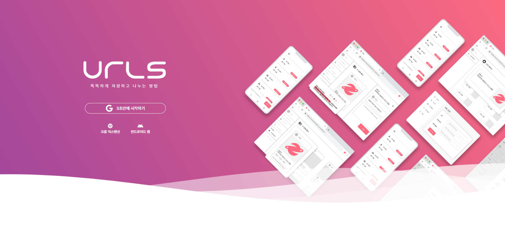

|             김재현 팀장             |               김문희                |               김우석                |               이다은                |               이두호                |
| :---------------------------------: | :---------------------------------: | :---------------------------------: | :---------------------------------: | :---------------------------------: |
|  |  |  |  |  |
|               Client                |                 FE                  |             DevOps. FE              |                 BE                  |                 AI                  |

- 서비스 명 : URLS
- 개발 기간 : 2021.10.11 ~ 2021.11.19 (6주)
- 팀명 : EAGLE_EYE

 

# 🎇 주요 기능

- url 저장 및 공유
  - 개인/공유 폴더로 url 관리 및 공유
  - url 저장 시 카테고리 및 태그를 함께 저장 가능
  - url 주소/태그 검색 기능
- url 추천 시스템
  - url 입력시 관련한 태그 추천
  - 저장한 url을 기반으로 사용자 성향을 분석하여 url 추천
- 메모 및 하이라이트
  - PC 웹페이지 / 안드로이드 앱에서 url 마다 메모 작성 가능
  - 크롬 익스텐션에서 url의 문단을 하이라이트 하여 표시 가능
- 다양한 플랫폼 제공
  - 반응형 PC 웹페이지
  - 안드로이드 앱
  - 크롬 익스텐션

 

# 🎞 구현

## 🖥 웹

### 1. URL 추가 / 삭제 

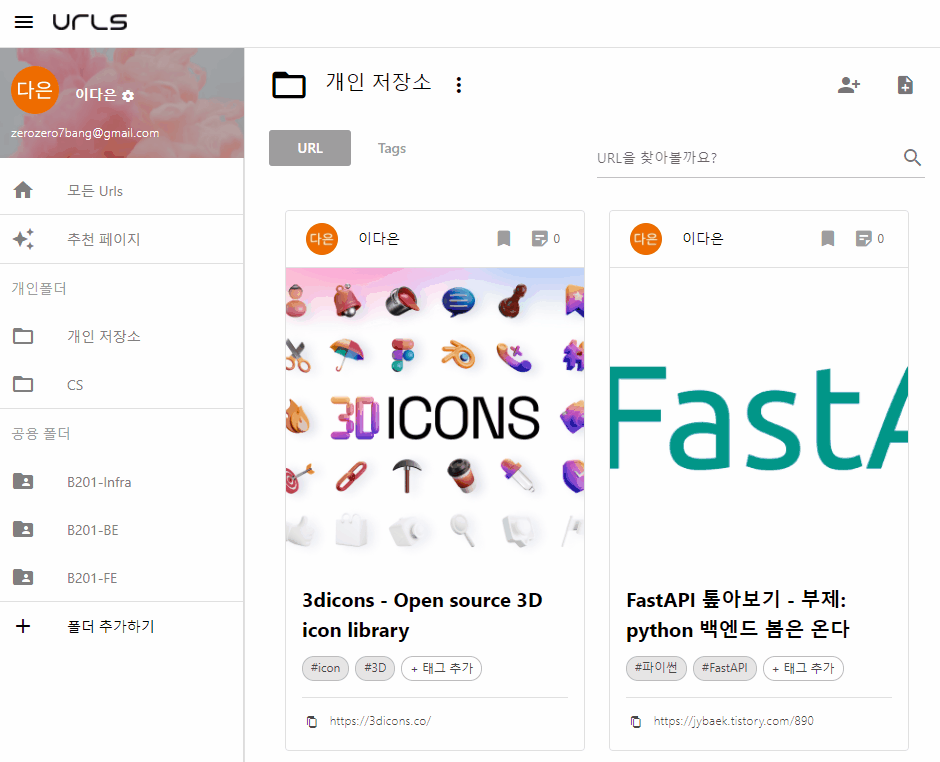

### 2. 팀원 추가 / 삭제

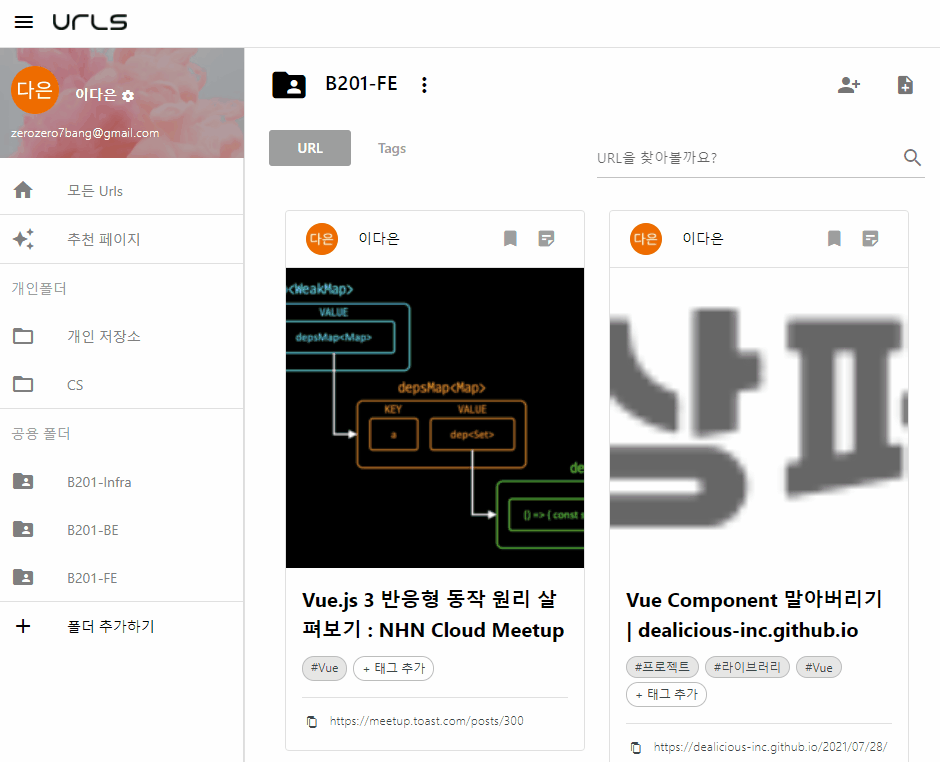

### 3. URL 추천

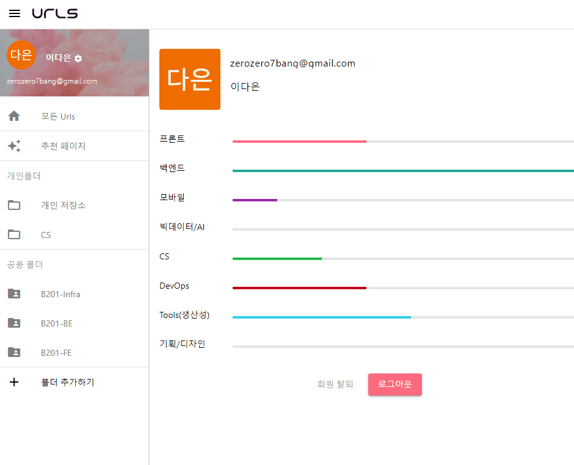

### 4. 검색

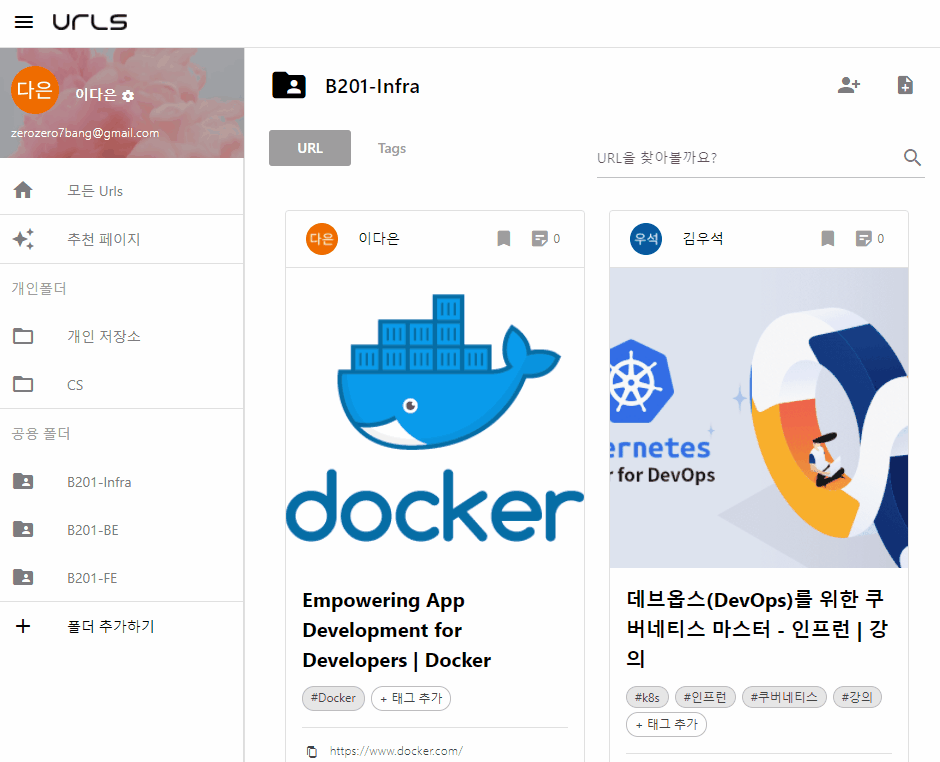

### 5. 메모/하이라이트

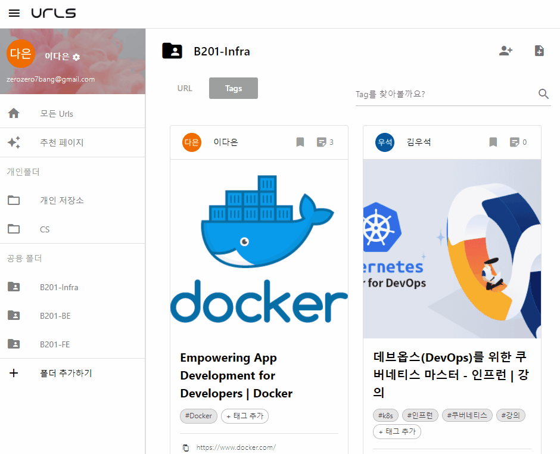

 

## 📱 안드로이드

### 1. 로그인

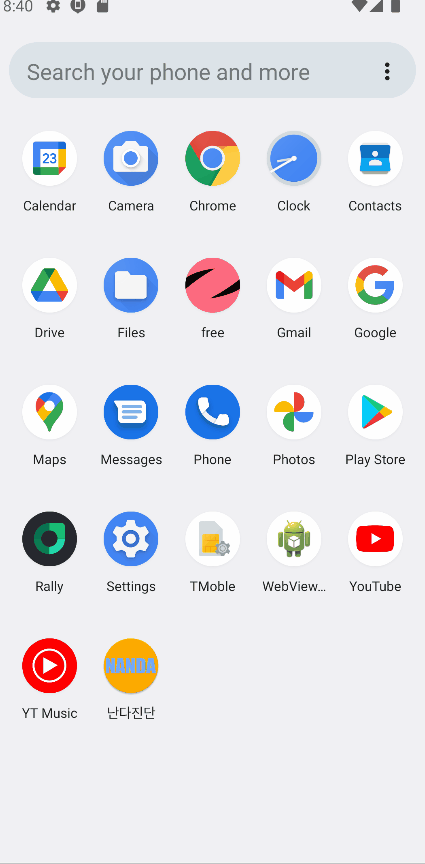

### 2. url 추가

### 3. url 추가 (메모 드래그 해서 추가)

.gif)

### 3. url 확인

### 4. 추천 url

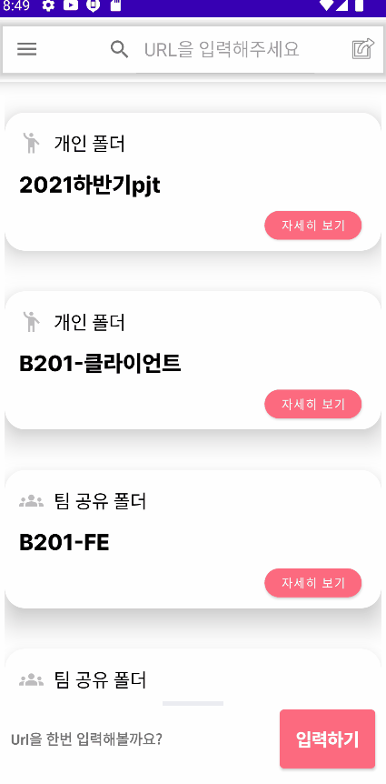

 

## 📟 크롬 익스텐션

### 1. URL 추가 

### 2. 폴더 확인 및 이동

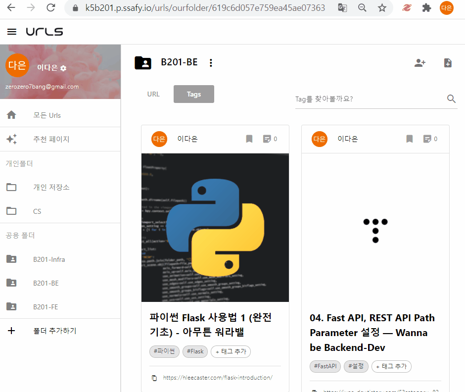

### 3. 하이라이트

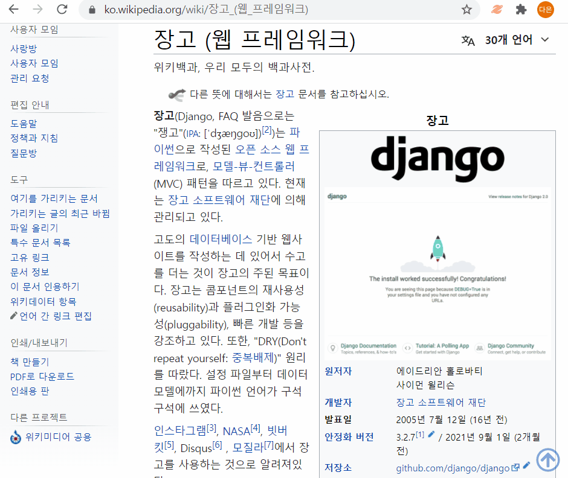

### 4. 공지사항 / 정보

 

# 🎈 실행 방법

- 웹 : https://k5b201.p.ssafy.io/
- 안드로이드 앱 : [URLS.apk 다운로드 링크](https://drive.google.com/drive/u/0/folders/1pcDM9PidYHWJONheYCC1Df8-2tyzUG5j)
- 크롬 익스텐션 : [dist 폴더 다운로드 링크 (1번 작업)](https://drive.google.com/drive/u/0/folders/1pcDM9PidYHWJONheYCC1Df8-2tyzUG5j)
  1. `client/c1` 폴더로 이동하여 `npm install` 한 후, `npm run dev` 를 하면 `dist` 폴더가 생성됨
  2. 크롬 브라우저의 우측 상단 `...` 을 눌러 `도구 더보기` > `확장 프로그램` 으로 이동
  3. 개발자 모드 on 한 후, `압축해제된 확장 프로그램을 로드합니다.` 를 눌러 `dist`파일 업로드 

 

# 🖼 기술스택

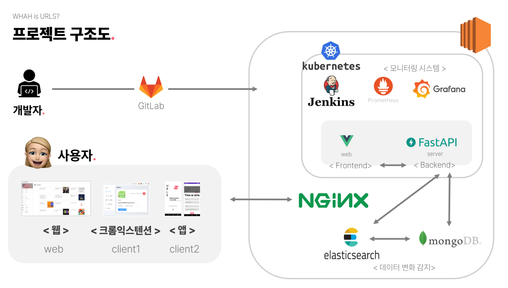

- Client : Android, chrome-extensions
- Frontend : Vue with Quasar
- Backend : FastAPI
- Infra : Kubernetes, mongoDB, elasticsearch, Nginx

 

# 🏆수상

## 🏅 삼성 청년 SW 아카데미(SSAFY) 자율 프로젝트 대전 반 1등

